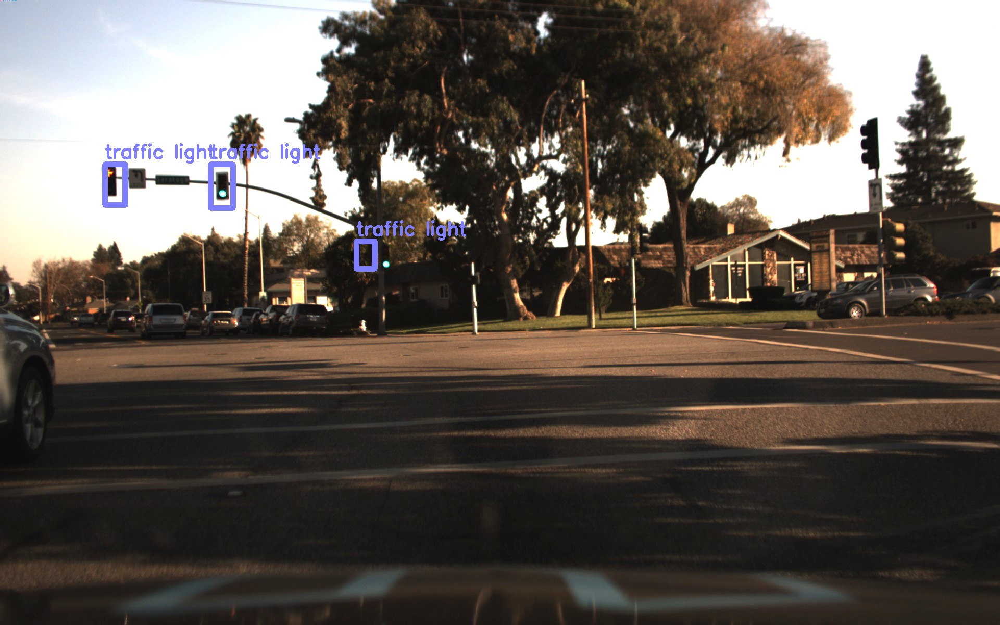
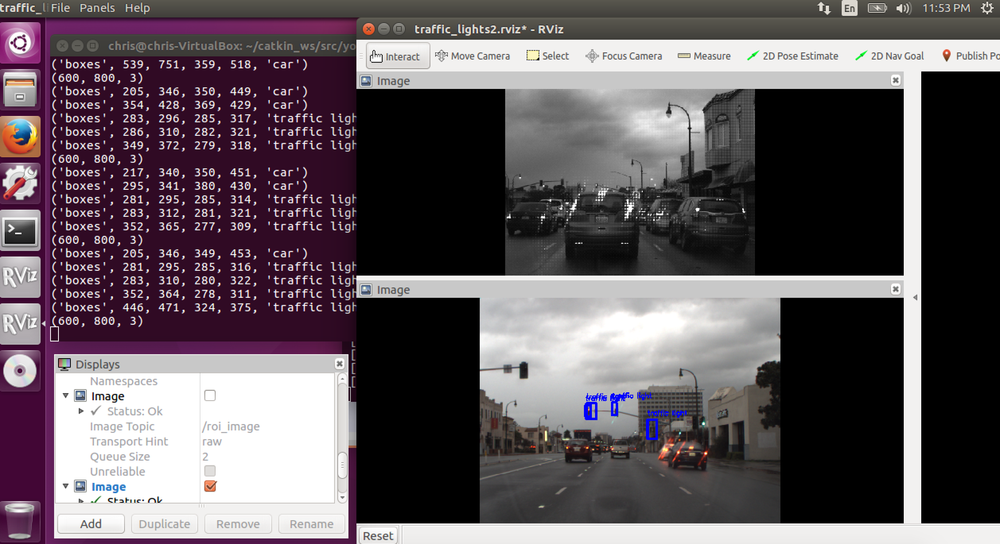

## Tiny-YOLOv2 ROS Node for Traffic Light Detection
This package was originally implemented by @[thtrieu](https://github.com/thtrieu). The original Tiny-YOLOv2 model was then trained against the annotated Udacity SDC datasets by several @[udacity](https://github.com/udacity/self-driving-car/tree/master/vehicle-detection/darkflow) open source community members. The model that they trained is capable of detecting cars, trucks, bicycles, pedestrians and traffic lights. This YOLOv2 model has been modified to be a traffic light detector and was implemented as a ROS node that can be run in ROS at real time on a GPU. I was able to get 14 Hz on an Amazon AWS K520 with the model running standalone and writing our images, so would expect significantly faster on a NVIDIA GTX 1070 or 1080 machine (will update once I can get an appropriate benchmark test). Here is an image of the model runnning standalone outside of ROS:



This repository can be used as a ROS package. It includes the python class `TLightNode` inside of `/scripts/tlight_node.py` that is run with `/scripts/darflow.py`. The traffic light detector node will subscribe to an `Image` topic and the publish the same image with traffic lights detected using boxes and annotations. A screenshot of the ROS node operating within ROS is shown below. Note that I only have ROS installed on a CPU at the momemt, so there is a significant lag in the published images. 



## Intro

Real-time object detection and classification. Paper: [version 1](https://arxiv.org/pdf/1506.02640.pdf), [version 2](https://arxiv.org/pdf/1612.08242.pdf).

Read more about YOLO (in darknet) and download weight files [here](http://pjreddie.com/darknet/yolo/). In case the weight file cannot be found, I uploaded some of mine [here](https://drive.google.com/drive/folders/0B1tW_VtY7onidEwyQ2FtQVplWEU), which include `yolo-full` and `yolo-tiny` of v1.0, `tiny-yolo-v1.1` of v1.1 and `yolo`, `tiny-yolo-voc` of v2.

## Dependencies

Python 2.7, tensorflow 1.0, numpy, opencv, ROS 1.0.

### Getting started

There are three ways to get started with darkflow.

1. Just build the Cython extensions in place.
    ```
    python setup.py build_ext --inplace
    ```

2. Let pip install darkflow in dev mode (globally accessible but changes to the code immediately take effect)
    ```
    pip install -e .
    ```

3. Install with pip globally
    ```
    pip install .
    ```

### Flowing the graph using `flow`

```bash
# Have a look at its options
./flow --h
```

First, let's take a closer look at one of a very useful option `--load`

```bash
# 1. Load yolo-tiny.weights
./flow --model cfg/yolo-tiny.cfg --load bin/yolo-tiny.weights

# 2. To completely initialize a model, leave the --load option
./flow --model cfg/yolo-3c.cfg

# 3. It is useful to reuse the first identical layers of tiny for 3c
./flow --model cfg/yolo-3c.cfg --load bin/yolo-tiny.weights
# this will print out which layers are reused, which are initialized
```

All input images from default folder `test/` are flowed through the net and predictions are put in `test/out/`. We can always specify more parameters for such forward passes, such as detection threshold, batch size, test folder, etc.

```bash
# Forward all images in test/ using tiny yolo and 100% GPU usage
./flow --test test/ --model cfg/yolo-tiny.cfg --load bin/yolo-tiny.weights --gpu 1.0
```

All input images from default folder `test/` are flowed through the net and predictions are put in `test/out/`. We can always specify more parameters for such forward passes, such as detection threshold, batch size, test folder, etc.

```bash
# Forward all images in test/ using tiny yolo and 100% GPU usage
./flow --test test/ --model cfg/yolo-tiny.cfg --load bin/yolo-tiny.weights --gpu 1.0
```
json output can be generated with descriptions of the pixel location of each bounding box and the pixel location. Each prediction is stored in the `test/out` folder by default. An example json array is shown below.
```bash
# Forward all images in test/ using tiny yolo and JSON output.
./flow --test test/ --model cfg/yolo-tiny.cfg --load bin/yolo-tiny.weights --json
```
JSON output:
```json
[{"label":"person", "confidence": 0.56, "topleft": {"x": 184, "y": 101}, "bottomright": {"x": 274, "y": 382}},
{"label": "dog", "confidence": 0.32, "topleft": {"x": 71, "y": 263}, "bottomright": {"x": 193, "y": 353}},
{"label": "horse", "confidence": 0.76, "topleft": {"x": 412, "y": 109}, "bottomright": {"x": 592,"y": 337}}]
```
 - label: self explanatory
 - confidence: somewhere between 0 and 1 (how confident yolo is about that detection)
 - topleft: pixel coordinate of top left corner of box.
 - bottomright: pixel coordinate of bottom right corner of box.

## Using darkflow from another python application

Please note that `return_predict(img)` must take an `numpy.ndarray`. Your image must be loaded beforehand and passed to `return_predict(img)`. Passing the file path won't work.

Result from `return_predict(img)` will be a list of dictionaries representing each detected object's values in the same format as the JSON output listed above.

```python
from darkflow.net.build import TFNet
import cv2

options = {"model": "cfg/yolo.cfg", "load": "bin/yolo.weights", "threshold": 0.1}

tfnet = TFNet(options)

imgcv = cv2.imread("./test/dog.jpg")
result = tfnet.return_predict(imgcv)
print(result)
```

### Training new model

Training is simple as you only have to add option `--train` like below:

```bash
# Initialize yolo-3c from yolo-tiny, then train the net on 100% GPU:
./flow --model cfg/yolo-3c.cfg --load bin/yolo-tiny.weights --train --gpu 1.0

# Completely initialize yolo-3c and train it with ADAM optimizer
./flow --model cfg/yolo-3c.cfg --train --trainer adam
```

During training, the script will occasionally save intermediate results into Tensorflow checkpoints, stored in `ckpt/`. To resume to any checkpoint before performing training/testing, use `--load [checkpoint_num]` option, if `checkpoint_num < 0`, `darkflow` will load the most recent save by parsing `ckpt/checkpoint`.

```bash
# Resume the most recent checkpoint for training
./flow --train --model cfg/yolo-3c.cfg --load -1

# Test with checkpoint at step 1500
./flow --model cfg/yolo-3c.cfg --load 1500

# Fine tuning yolo-tiny from the original one
./flow --train --model cfg/yolo-tiny.cfg --load bin/yolo-tiny.weights
```

### Training against Udacity Self Driving Datasets

Udacity Self Driving Car course have provided an annotated dataset of images that contains bounding boxes for five classes of objects: cars, pedestrians, truck, cyclists and traffic lights.

A model cfg based on v1.1/tiny-yolo is provided for the udacity dataset in cfg/v1.1/tiny-yolov1-5c.cfg, with a TensorFlow checkpoint [here](https://drive.google.com/file/d/0B2K7eATT8qRARVVvcGtQUzRBV1E/view?usp=sharing). A v2 tiny-yolo configuration for the udacity dataset could be found under cfg/tiny-yolo-udacity.cfg, with checkpoint [here](https://drive.google.com/file/d/0B2K7eATT8qRAY0g0aWhjdkw0bEU/view?usp=sharing).
